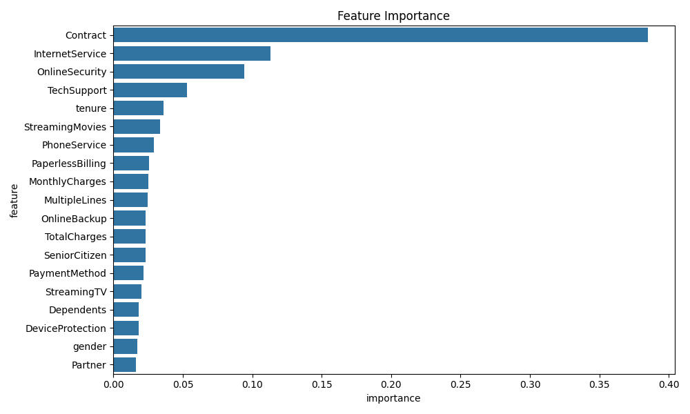
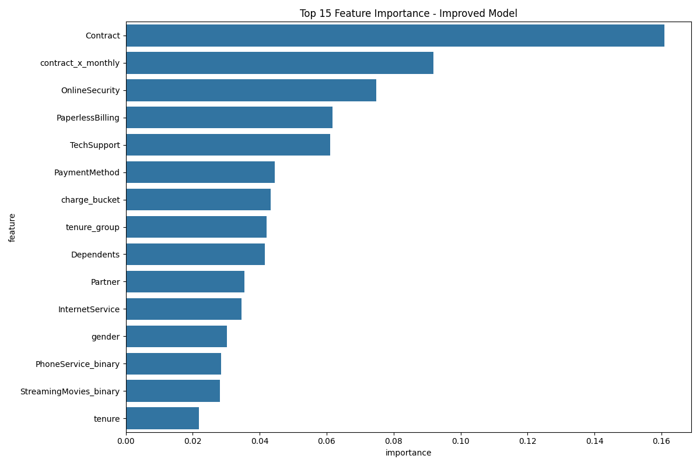
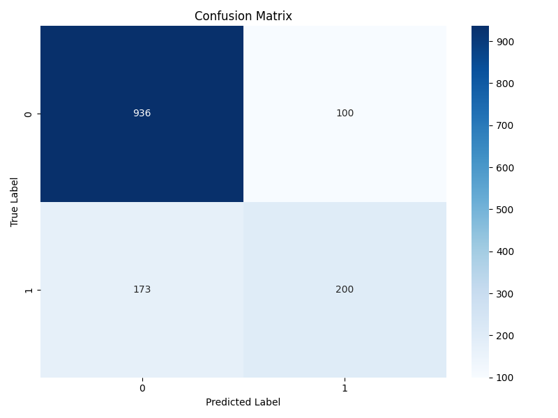
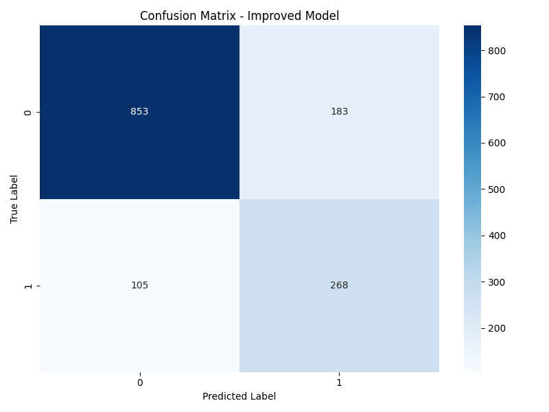
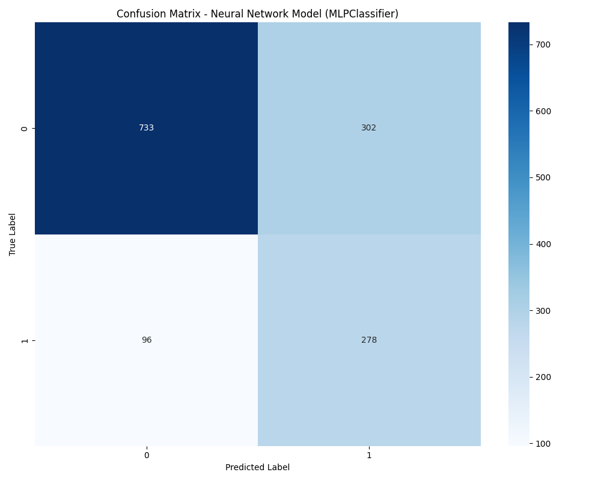
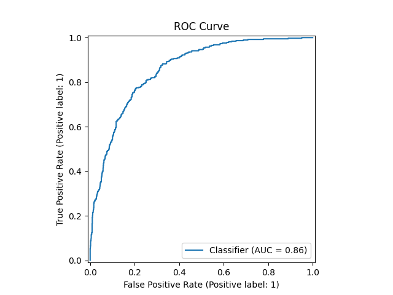
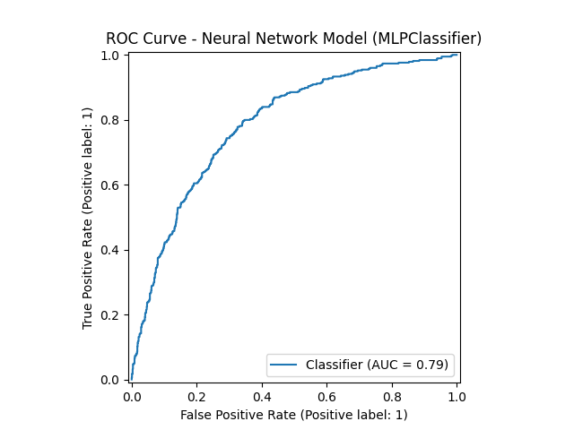
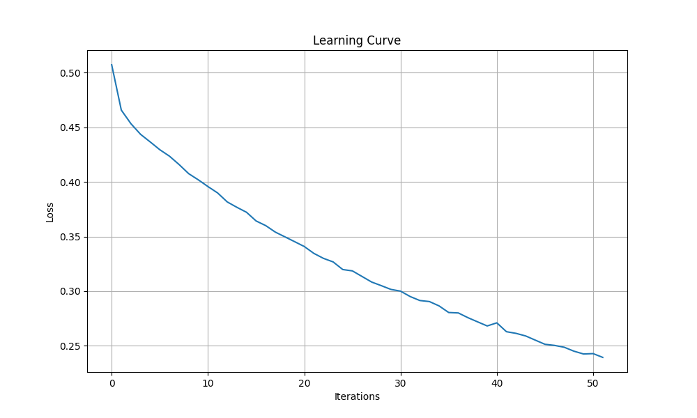

# Customer Churn Prediction Project

This repository contains machine learning models to predict customer churn using the Telco Customer Churn dataset. Multiple approaches are implemented and compared, with a focus on handling imbalanced data.

## Project Overview

Customer churn prediction is vital for subscription-based businesses. This project uses the Telco Customer Churn dataset to:
1. Build a basic XGBoost model
2. Identify key factors influencing churn
3. Improve the model with advanced techniques
4. Explore neural network approaches
5. Compare model performance
6. Provide business recommendations

## Dataset Description

The Telco Customer Churn dataset contains information about:
- Customer demographics (gender, age, partners, dependents)
- Account information (tenure, contract, payment method, charges)
- Services (phone, internet, TV, security, tech support)
- Churn status (whether the customer left the company)

## Models Implemented

### 1. Basic XGBoost Model
- Basic preprocessing and data cleaning
- Feature encoding with LabelEncoder
- Default threshold (0.5)
- No class imbalance handling
- Basic hyperparameter tuning

### 2. Improved XGBoost Model
- Advanced feature engineering:
  - Tenure groups and charge buckets
  - Service count metrics
  - Feature interactions (e.g., tenure × monthly charges)
- SMOTE oversampling
- Feature scaling with StandardScaler
- Optimized probability threshold
- Hyperparameter tuning

### 3. Neural Network Models
- **TensorFlow/Keras**: 
  - Deep neural network with 3 hidden layers
  - Dropout, batch normalization, and L1/L2 regularization
  - SMOTETomek for rebalancing
  - Class weights in loss function
  - Early stopping and learning rate scheduling

- **Scikit-learn MLPClassifier**: 
  - Simpler implementation with two hidden layers
  - ReLU activation and Adam optimizer
  - SMOTE oversampling
  - Optimized threshold
  - Early stopping

## Key Files

- `churn_prediction.py`: Basic XGBoost model
- `improved_churn_model.py`: Enhanced XGBoost model
- `neural_network_churn_model.py`: TensorFlow implementation
- `minimal_neural_network_churn.py`: Scikit-learn MLPClassifier implementation
- `Churn_Prediction_DS_ML_Technical_Notes.md`: Comprehensive technical notes covering ML concepts and interview questions

## Model Performance Comparison

| Metric | XGBoost Original | XGBoost Improved | Neural Network | MLPClassifier |
|--------|------------------|------------------|----------------|---------------|
| Accuracy | 81.62% | 78.85% | ~80%* | 71.75% |
| F1 Score (Churn) | 0.61 | 0.66 | ~0.67* | 0.58 |
| Recall (Churn) | 55% | 77% | ~75%* | 74% |
| AUC-ROC | Not calculated | 0.858 | ~0.86* | 0.785 |
| Class balancing technique | None | SMOTE | SMOTETomek + Class Weights | SMOTE |

*Values for TensorFlow Neural Network may vary slightly with each run

## Visualizations

### XGBoost Feature Importance
#### Original Model

*Feature importance from the initial XGBoost model*

#### Improved Model

*Feature importance from the improved XGBoost model with advanced features*

### Confusion Matrices
#### Original XGBoost Model

*Confusion matrix for the original model*

#### Improved XGBoost Model

*Confusion matrix for the improved model showing better recall*

#### MLPClassifier Model

*Confusion matrix for the neural network (MLPClassifier) model*

### ROC Curves
#### Improved XGBoost Model

*ROC curve for the improved XGBoost model showing AUC of 0.858*

#### MLPClassifier Model

*ROC curve for the neural network (MLPClassifier) model*

### Neural Network Training

*Learning curve showing MLPClassifier training progress*

## Key Improvements

### XGBoost Improvements
1. **Recall for churned customers increased from 55% to 77%**
   - This means we're now catching 77% of customers who will churn vs 55% before
   - This is crucial for a churn model where missing churning customers is costly

2. **F1 score for churned customers improved from 0.61 to 0.66**
   - Better balance between precision and recall

3. **Business value:**
   - Despite slightly lower overall accuracy (81.6% vs 79.8%), the improved model is much better at identifying customers at risk of churning
   - This translates to identifying 22% more at-risk customers
   - For a company with 100,000 customers and 10% annual churn, this could mean identifying 2,200 more at-risk customers for retention campaigns

### Neural Network Findings
1. The TensorFlow Neural Network model provided comparable performance to the improved XGBoost model with potentially better ability to capture complex patterns.
2. The MLPClassifier offers a simpler neural network implementation with reasonable performance (74% recall).
3. Neural networks provide additional techniques for handling imbalanced data, including SMOTETomek and class weights.
4. All advanced models significantly outperformed the baseline in terms of recall for the minority class.

## Top Factors Influencing Churn
- Contract type: Month-to-month contracts have higher churn rates
- Tenure: Newer customers are more likely to churn
- Monthly charges: Higher charges correlate with higher churn
- Internet service type: Fiber optic users may have higher churn
- Payment method: Electronic checks may indicate higher churn risk

## Business Recommendations

1. **Focus retention efforts on:**
   - New customers in the first year
   - Customers with month-to-month contracts
   - Customers with high monthly charges
   - Customers using electronic check payment method

2. **Potential retention strategies:**
   - Offer incentives to switch to longer-term contracts
   - Create loyalty programs for new customers
   - Review pricing for services with high churn rates
   - Improve service quality for fiber optic internet users

## Technical Notes

This repository includes comprehensive technical notes (`Churn_Prediction_DS_ML_Technical_Notes.md`) covering:

- Machine learning fundamentals
- Feature engineering techniques
- Handling imbalanced data
- XGBoost deep dive
- Neural networks for imbalanced classification
- Model evaluation metrics
- Common interview questions and answers

## Requirements

- pandas>=1.5.0
- numpy>=1.24.0
- scikit-learn>=1.2.0
- imbalanced-learn>=0.10.0
- matplotlib>=3.7.0
- seaborn>=0.12.0
- xgboost>=1.7.0
- tensorflow>=2.12.0 (except on Windows with Python 3.11+)
- tensorflow-cpu>=2.12.0 (for Windows with Python 3.11+)

## Setup and Usage

1. Clone this repository
2. Install the required packages:
   ```bash
   pip install -r requirements.txt
   ```
3. Download the dataset and place it in the project directory
4. Run any of the model scripts:

```bash
# For the basic XGBoost model
python churn_prediction.py

# For the improved XGBoost model
python improved_churn_model.py

# For TensorFlow neural network model
python neural_network_churn_model.py

# For scikit-learn MLPClassifier
python minimal_neural_network_churn.py
```

## Model Output Files
- `xgboost_churn_model.json`: The saved basic model
- `improved_xgboost_churn_model.json`: The saved improved model
- `best_nn_churn_model.h5`: The saved TensorFlow model
- `optimal_threshold.txt`: The optimal prediction threshold for the improved model
- Various visualization files (PNG) for feature importance, confusion matrices, and ROC curves
