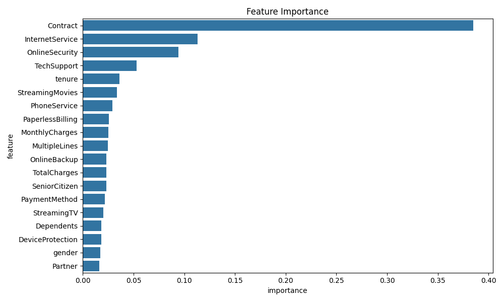
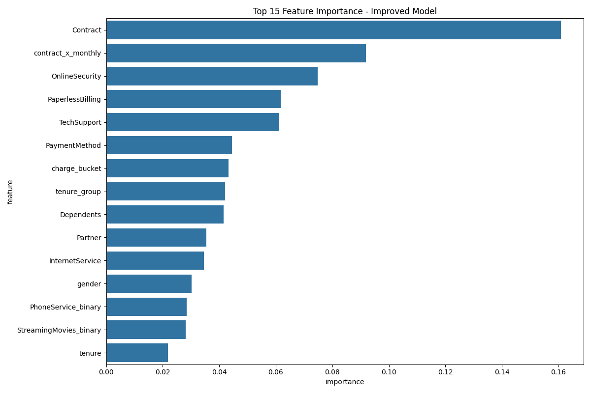
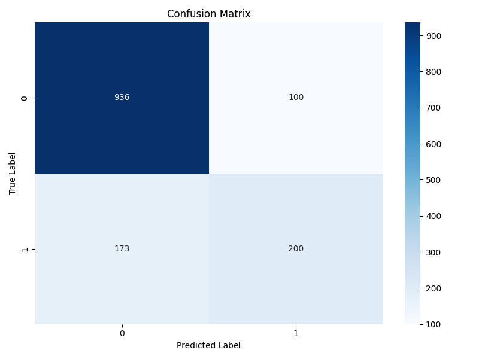
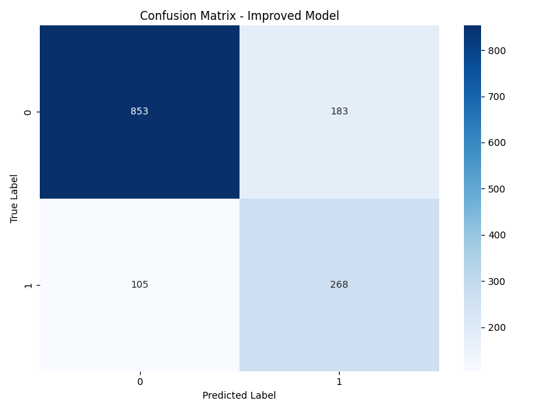
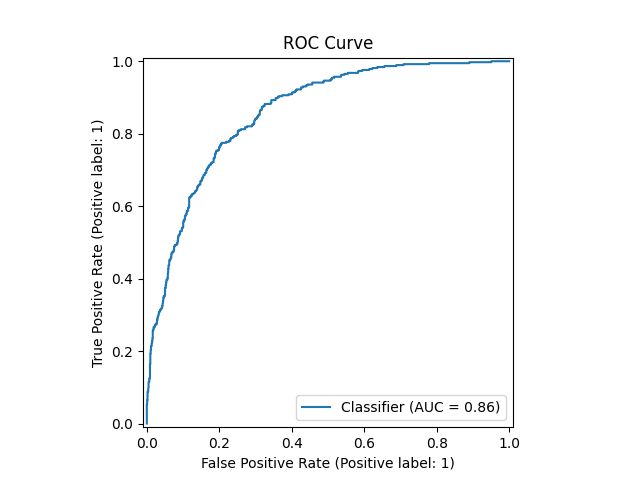

# Customer Churn Prediction with XGBoost

This project demonstrates how to predict customer churn using XGBoost, with a focus on model improvement techniques.

## Project Overview

Customer churn prediction is vital for subscription-based businesses. This project uses the Telco Customer Churn dataset to:
1. Build a basic XGBoost model
2. Identify key factors influencing churn
3. Improve the model with advanced techniques
4. Compare model performance
5. Provide business recommendations

## Dataset Description

The Telco Customer Churn dataset contains information about:
- Customer demographics (gender, age, partners, dependents)
- Account information (tenure, contract, payment method, charges)
- Services (phone, internet, TV, security, tech support)
- Churn status (whether the customer left the company)

## Methods Used

### Initial Model
- Basic XGBoost model with hyperparameter tuning
- Feature encoding with LabelEncoder
- Basic preprocessing and data cleaning

### Improved Model
- Advanced feature engineering:
  - Tenure groups and charge buckets
  - Service count metrics
  - Feature interactions (e.g., tenure × monthly charges)
- Class imbalance handling with SMOTE
- Feature scaling with StandardScaler
- Optimized probability threshold
- ROC-AUC evaluation

## Key Results

### Model Comparison

| Metric | Original Model | Improved Model |
|--------|---------------|---------------|
| Accuracy | 81.62% | 79.79% |
| Class imbalance handling | None | SMOTE |
| F1 score (Churned customers) | 0.61 | 0.66 |
| Recall (Churned customers) | 0.55 | 0.77 |
| Feature engineering | Basic | Advanced |
| AUC-ROC | Not calculated | 0.858 |

### Visualizations

#### Feature Importance

*Feature importance from the initial XGBoost model*


*Feature importance from the improved XGBoost model with advanced features*

#### Confusion Matrices

*Confusion matrix for the original model*


*Confusion matrix for the improved model showing better recall*

#### ROC Curve for Improved Model

*ROC curve for the improved model showing AUC of 0.858*

### Key Improvements
1. **Recall for churned customers increased from 55% to 77%**
   - This means we're now catching 77% of customers who will churn vs 55% before
   - This is crucial for a churn model where missing churning customers is costly

2. **F1 score for churned customers improved from 0.61 to 0.66**
   - Better balance between precision and recall

3. **Business value:**
   - Despite slightly lower overall accuracy (81.6% vs 79.8%), the improved model is much better at identifying customers at risk of churning
   - This translates to identifying 22% more at-risk customers
   - For a company with 100,000 customers and 10% annual churn, this could mean identifying 2,200 more at-risk customers for retention campaigns

### Top Factors Influencing Churn
- Contract type: Month-to-month contracts have higher churn rates
- Tenure: Newer customers are more likely to churn
- Monthly charges: Higher charges correlate with higher churn
- Internet service type: Fiber optic users may have higher churn
- Payment method: Electronic checks may indicate higher churn risk

## Business Recommendations

1. **Focus retention efforts on:**
   - New customers in the first year
   - Customers with month-to-month contracts
   - Customers with high monthly charges
   - Customers using electronic check payment method

2. **Potential retention strategies:**
   - Offer incentives to switch to longer-term contracts
   - Create loyalty programs for new customers
   - Review pricing for services with high churn rates
   - Improve service quality for fiber optic internet users

## How to Use This Project

### Setup
```bash
# Clone the repository
git clone https://github.com/yourusername/customer-churn-prediction.git
cd customer-churn-prediction

# Install required packages
pip install -r requirements.txt
```

### Running the Models
```bash
# Run the basic model
python churn_prediction.py

# Run the improved model
python improved_churn_model.py

# Compare model performance
python compare_models.py
```

### Making Predictions
```bash
# Make predictions on new customers
python predict_new_customers.py
```

## Sample Prediction Output

When running the prediction script, you'll get output similar to this:

```
--- Churn Predictions ---
   tenure        Contract  MonthlyCharges InternetService  Churn_Probability Predicted_Churn
0       6  Month-to-month           70.35             DSL           0.444547              No
1      24        One year           89.10     Fiber optic           0.190609              No
2      48        Two year           45.50             DSL           0.013499              No
3      12  Month-to-month           30.20              No           0.115900              No

===== CUSTOMER RISK ASSESSMENT =====

Customer Risk Levels:
Low Risk: 3 customers
Medium Risk: 1 customers
High Risk: 0 customers
```

## File Descriptions

- `churn_prediction.py`: Basic XGBoost model
- `analyze_results.py`: Analysis of feature importance and model performance
- `predict_new_customers.py`: Using the model for new customer predictions
- `improved_churn_model.py`: Enhanced model with better techniques
- `compare_models.py`: Comparing the performance of both approaches
- `requirements.txt`: Required Python packages
- `telco-customer-churn.csv`: The dataset used for model training

## Model Output Files
- `xgboost_churn_model.json`: The saved basic model
- `improved_xgboost_churn_model.json`: The saved improved model
- `optimal_threshold.txt`: The optimal prediction threshold for the improved model
- Various visualization files (PNG) for feature importance, confusion matrices, and ROC curves 